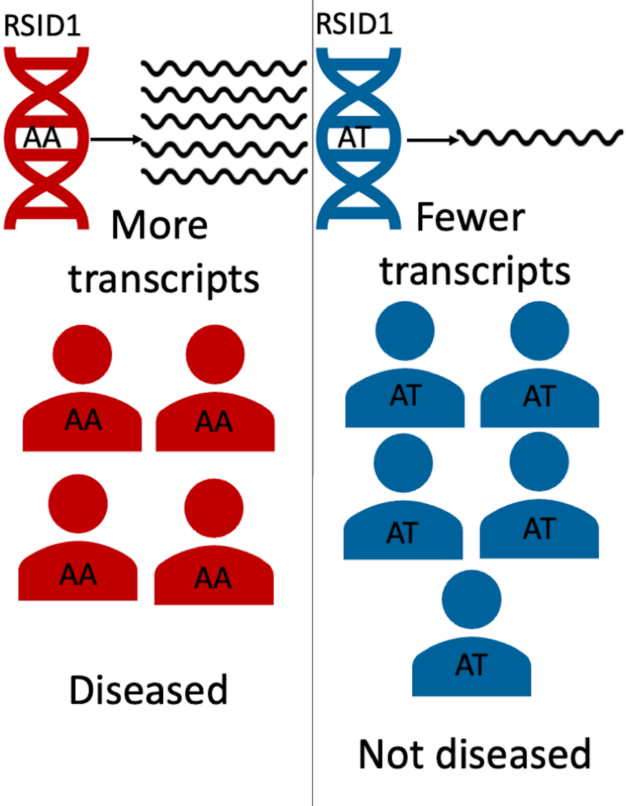

As seen above, the diseased population may have one variant of DNA (AA), and the non-diseased population may have a different one (AT). The AA in the diseased population's DNA may lead to increased transcripts of a particular gene, which in turns leads to the presence of the disease. Identifying these gene-based mechanism of disease risk is crucial to facilitate early diagnosis and treatment of individuals. Previous approaches attempted to understand this mechanism by detecting key variants associated with gene expression, which in turn is responsible for regulating the production of certain key proteins that can lead to the presence of certain diseases[1](https://notsamzhou.github.io/twas/references/). For example, GWAS finds thousands of trait-associated variants, however, 93% of disease and trait-associated variants emerging from these studies lie within noncoding sequences of the DNA[2](https://notsamzhou.github.io/twas/references/). This makes it difficult to understand the functionality of these variants and their association with disease risk. In addition, it is infeasible to measure gene expression in as many people that are in a GWAS cohort.

What is TWAS and Why is it Important?
------
For our project, we decided to use a technique called TWAS that aggregates variant effects on gene expression and estimates a gene level association[3](https://notsamzhou.github.io/twas/references/). TWAS aims to identify genes that lead to manifestation of complex human traits due to genetically regulated transcriptional activity[4](https://notsamzhou.github.io/twas/references/). It integrates genome-wide association studies (GWAS) and gene expression datasets to identify gene–trait associations . TWAS leverages eQTL cohorts with expression and genotype data to discover gene–trait associations from GWAS summary statistics. The eQTL cohort is then used to find predictive models of gene expression by using allele counts of genetic variants in the gene’s vicinity[5](https://notsamzhou.github.io/twas/references/). The model is then used to impute the genetic component of gene expression in a large sample of people with genotyping results (ex. a GWAS cohort). Finally, TWAS correlates the disease phenotype and predicts gene expression to find disease associated genes[6](https://notsamzhou.github.io/twas/references/). Ultimately TWAS is powerful in identifying the disease associated gene by aggregating the effects of multiple variants into a single testing unit[3](https://notsamzhou.github.io/twas/references/). Identification of a gene, rather than just a variant, can enable scientists to create drugs targeting a specific gene that can potentially offset or mitigate the effects of the associated disease.

The Disease of Interest: IBD
------
Inflammatory Bowel Disease (IBD) is a highly heritable disease, which causes a chronic inflammation of tissues in an individual’s digestive tract[7](https://notsamzhou.github.io/twas/references/). This disease affects 3.1 million adults in the United States and adversely impacts their quality of life[8](https://notsamzhou.github.io/twas/references/). Even though GWAS has identified hundreds of variants associated with Inflammatory Bowel Disease (IBD), there are few known associated genes. For our project we decided to leverage TWAS to identify the genes associated with IBD. To this end, we utilized gene expression data from whole blood samples because IBD is an immune disease and blood will contain the relevant cell types.

---

[Back to top](#top)
