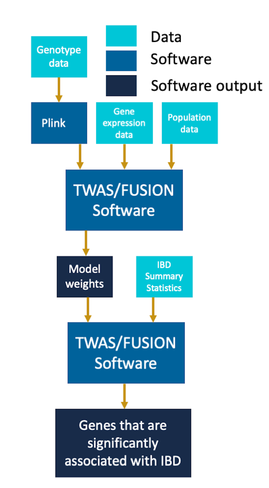

Data
------

The genotype data that we worked with was collected from Phase 1 of the 1000 Genomes Project, Release Version 3 for chromosome 22. This dataset contains data on millions of SNPs for hundreds of individuals, which we attempt to connect to our gene expression dataset to identify potential relationships. We combined this single nucleotide polymorphisms (SNP) data with gene expression data from RNA-sequencing on LCL samples from the Geuvadis RNA-sequencing project, retrieved from EBI ArrayExpress. Together, these data sources contain genetic data for 344 individuals across four populations: CEPH (CEU), Finns (FIN), British (GBR), and Toscani (YRI). Combining these data sources, we are able to identify relevant SNPs to each gene. We identified cis/local-SNPs as those found within 1Mb of the transcription start site (TSS) of each gene from the Geuvadis project. We considered SNPs that had a minor allele frequency greater than 0.05 to be common, and obtained variant information for these SNPs across all individuals. To perform TWAS, we also required the summary statistics of our chosen disease, IBD.  The GWAS summary statistics for IBD were obtained from the analysis carried out in the paper Finucane 2015, Nature Genetics.

Methods
------

To perform our analysis, we downloaded the genotype and gene expression data from 1000 Genomes project, phase 1 release 3. We filtered the gene expression data to focus our analysis on chromosome 22. We also retrieved additional information about the individual’s population groups and merged it with our gene expression data for these individuals. To work with the genotype data, we used plink to convert the original VCF files into the bed, bim and fam files containing the genotype information about the individuals. When extracting the genotype information using plink we removed variants that were not biallelic and had an allele frequency less than .05. 

Once we identified the significantly heritable genes and their corresponding cis-SNPs using the GCTA script, for each gene we created a linear model to predict gene expression, weighted by the SNPs. We assume that SNPs additively contribute to a phenotype. For each gene, this follows the following linear model:

$$y_i = \sum_j X_{ij} \beta_{j}$$

where $y_i$ represents the gene expression for an individual i, $X_{ij}$ represents the estimated minor allele count of SNP $j$ for the individual $i$, and $\beta_j$ is an unknown weight on cis-SNP $j$. To estimate the $\hat{\beta_j}$ for each gene, we used three different modeling techniques - lasso regression, elastic net regression, and only using the single-best eQTL. Both lasso regression and elastic net are regularization techniques that aim to reduce overfitting of our linear regression model. Lasso regularization aims to do so by minimizing the following, using an L1 penalty:

$$||y_i - \sum_j X_{ij}	\hat{\beta_j}||^2 + \lambda ||\hat{\beta_j}||$$
			
Elastic net regression minimizes the following error, using both L1 and L2 penalties:

$$||y_i - \sum_j X_{ij}	\hat{\beta_j}||^2 +  \lambda_1 ||\hat{\beta_j}|| + \lambda_2 ||\hat{\beta_j}||^2$$

These two methods incorporate information from all of the cis-SNPs of a gene. With the single-best eQTL method, the estimated minor allele count for only the most significantly associated SNP was used to model a gene’s expression. For this method, the rest of the SNP weights are set to zero.

After fitting these three models for each gene, we performed the summary-based imputation TWAS analysis. To perform the analysis, for each gene we use each set of the model weights obtained above along with GWAS summary statistics for IBD for the corresponding cis-SNPs. Let $Z$ bet the standardized GWAS effect sizes of the corresponding SNPs on the trait. We impute the effect size of the expression-trait association using a linear combination of the estimated weights $\hat{\beta}$ with $Z$. To test for significance, our null hypothesis is that there is no association and that $Z$ follows a multivariate normal distribution $Z \sim \mathcal{N}(0, \Sigma)$, where  $\Sigma$ is the covariance/LD matrix among all SNPs. Under these assumptions, $\hat{\beta}^TZ$ has a variance of $\hat{\beta}\Sigma \hat{\beta}$, and the standardized imputed Z-score of the association is as follows:

$$\frac{\hat{\beta}^TZ}{  \hat{\beta}\Sigma \hat{\beta}}$$

We then compute imputed Z-scores for every gene with relation to IBD using each of the different regression methods and identify the best-performing model for each gene. We can then use these standardized Z-scores to calculate p-values and identify significant associations between genes and the presence of IBD. This methodology is particularly useful as it allows us to impute gene expression into the GWAS summary-based data and exploit the GWAS data’s large sample size to draw significant associations.

---

[Back to top](#top)
