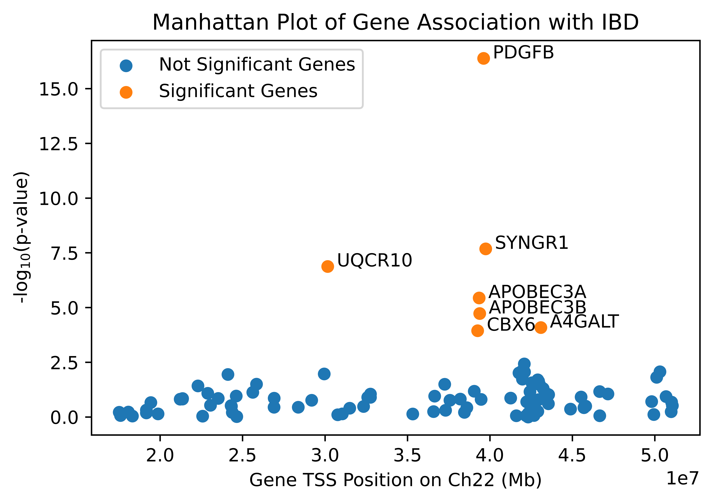
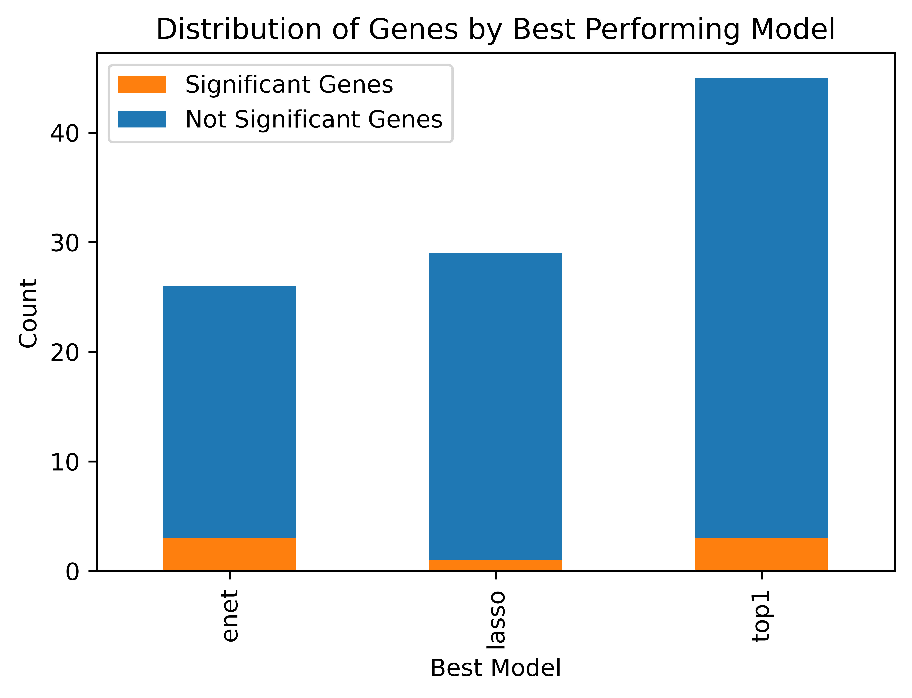
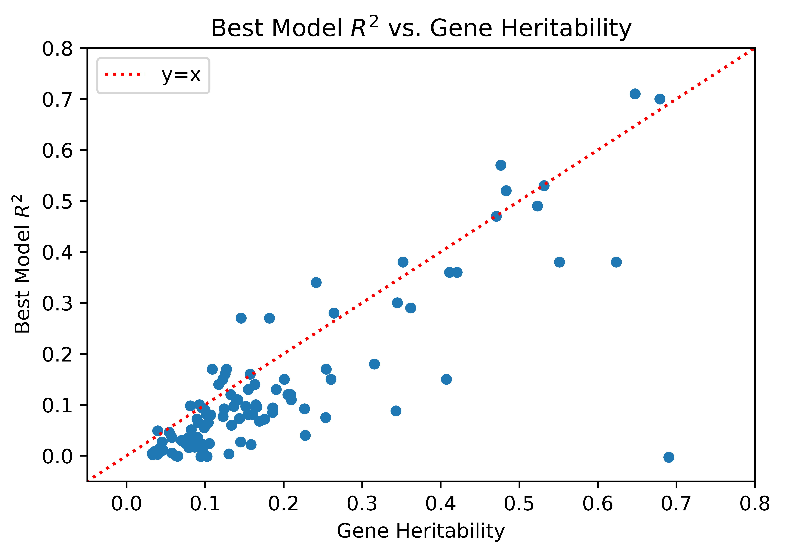

Out of 633 genes on chromosome 22, TWAS found 100 genes that are highly heritable with IBD, 7 of which had a significant association with IBD. The locations of the 100 heritable genes along with their $-log_{10}$ p-values are shown below in Figure 1.

  
  
Figure 1

Of the 7 genes, 5 of them were very close together on chromosome 22 and shared the same best GWAS SNP, which might suggest that they contribute to the same signal. This highlights TWAS’s ability to identify the actual genes associated with a particular disease, rather than just the GWAS SNPs. Gene PDGFB had the most significant association with a p-value of 4.17 x 10−17

For each gene, we were able to identify which modeling technique performed the best. Figure 2 depicts this distribution.

  
Figure 2

As we can see above, for most genes (45 out of 100), the single best eQTL model performed the best. For significant genes, elastic net regression and using single-best eQTL were the best performing models for three genes each, and lasso regression was the best model for only one.

In addition, we found that the R2 for each gene was reasonably bounded by heritability. This is to be expected and hence serves as a sanity check for our findings.

  
Figure 3

In conclusion, TWAS was ultimately able to identify 7 genes that are associated with IBD
One of the genes, A4GALT, did not have any genome-wide significant GWAS SNPs nearby. This highlights that TWAS is able to find relevant genes even if that locus is not genome-wide significant in GWAS. It was also interesting to see that our findings could be verified by other sources. For example, Marigorta et. al (2017) showed that there was an association between SYNGR1 and IBD, which our analysis was also able to identify. Thus, the use of a technique like TWAS for the identification of these genes can be crucial for disease prevention and early detection.

---

[Back to top](#top)